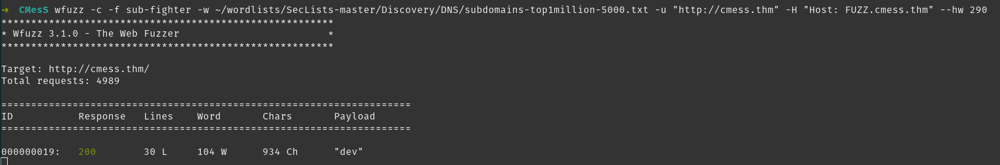
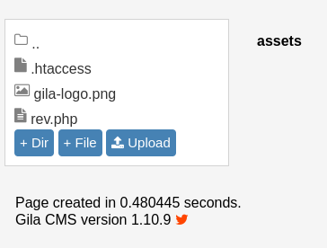
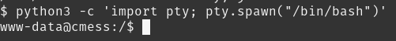

## CMesS
First I added the IP to hosts as cmess.thm as instructed on the page.

## Enumeration

# nmap


Looks like it's running http, time to enumerate with gobuster while I look around the website.

# Website


While looking around the site I found it runs Gila CMS. Looks like there's an RCE exploit on searchsploit for version 2.0.0

Gobuster found a page at /login so I'll check that out. Doesn't seem to be anything to find here as it sends an email to reset rather than being a form of some kind.

# Exploit

Let's look into the exploit found with searchsploit.

I mirror the exploit to look through how it works. 


It looks like it takes a command and runs it by using php and setting a session ID cookie. I'll modify the command to spawn a remote shell and edit the target to point to the site.

I start a netcat listener on port 9876.

Ran the exploit and got nothing, maybe not the right thing here. Back to enumeration.

# subdomain

Running wfuzz I get loads of results because I haven't filtered anything. It looks like the default result is 290 words so I filter that out of my second attempt. 



I find the subdomain dev and add it to hosts to look at it.

# dev log page

Found a dev log with a password in the plaintext.


# admin panel

Logged into the admin panel as andre, using the password found in the dev log.


Found a file manager, going to try to upload a reverse shell script.


Looks like it appeared in the assets folder. 



Starting a new netcat listener on 9875 and navigating to the assets/rev.php page.

# Shell

We have a shell!


Upgrading shell with python.



Can't find user.txt with find. Maybe not visisble to www-data.

`find / -perm /4000 -type f -exec ls -ld {} ; 2>/dev/null` Doesn't find anything interesting.

/etc/crontab contains an interesting backup job. We can't get into Andre's folder at the moment so might be useful later.


Time to use linpeas

# linpeas

First we upload it by changing to /tmp on the server, starting a python http server in our exploits directory and grabbing the file with wget. Then we chmod +x the file and run it.

Some interesting writable files found.


Contents of /opt/.password.bak

```
andres backup password
********
```
# Switching to Andre's account

su andre with the password in the /opt/.password.bak file worked for switching user.

We found user.txt in Andre's home directory. Time to look at if we can exploit that backup job we found earlier.

Having exploited these before I have a note in my exploits folder containing the following commands: 


We first start a netcat listener on 9876 and then run these commands in /home/andre/backup then just wait for the connection.

We get a connection and check id, we have root!


Room complete, this was a satisfying one as I didn't have to look for any help as I had exploited tar backup cronjobs previously.