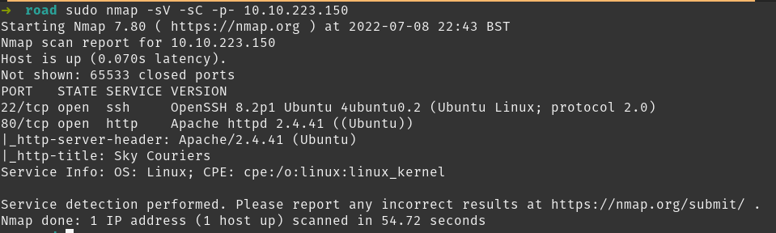
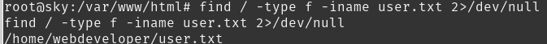

## Road

## NMAP

## Website

After looking around the site we find there is a login page with a registration form.

We register the user bob@bob.bob with a dummy mobile and password bob.
Dashboard:

Upload button disabled. Access only to admin@sky.thm

Reset password page, username uneditable. Try capturing with Burp Suite.

Request passes username as well as new password, send to repeater to try editing.

Changed user to admin@sky.thm. Looks to have been successful.

Logged in as admin.

Uploading php reverse shell.

Tested uploading an image to find upload location, it looks like the profile image path is commented out so picture doesn't update.

Starting netcat listener.

Accessing reverse shell at <MACHINE-IP>/v2/profileimages/rev.php

Remote shell gained, stabilised with python.

Using find / -perm /4000 -type f -exec ls -ld {} \\; 2>/dev/null to find useful suid binaries.

Nothing interesting there. Starting a python http server to upload exploits.

I was going to run LinPeas but decided to try PwnKit first. Downloading and executing PwnKit.

Escalated to root!

Finding user.txt

Finding root.txt

find linux version

An interesting box, I feel I missed something by using PwnKit to get root so easily as I imagine it was made before it was available and they had something else in mind.